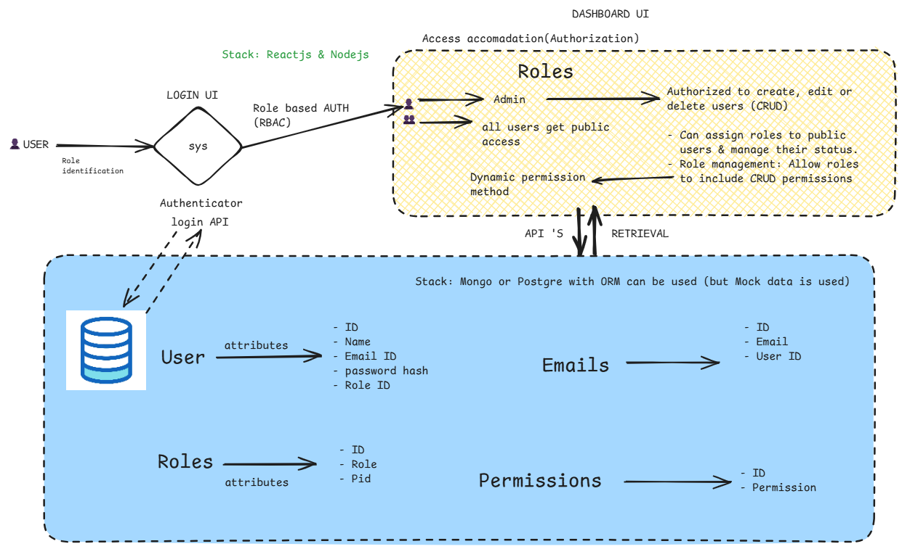

# RBACsys

## Tech stack
### Frontend
- React
- Typescript
- TailwindCSS
- Vite

### Backend (mock-api)
- NodeJS (Express)
- Typescript

## Initial Flow design
### Basic Flow


### Types of Users


### User credentials
```
Account Admin
Email: account.admin@example.com
Password: admin123
Role: Account Admin
Permissions: create:user, delete:user, assign:role, manage:system, manage:security, view:logs, access:data

System Admin
Email: sys.admin@example.com
Password: sysadmin123
Role: Sys Admin
Permissions: manage:system, view:logs, access:data

Security Admin
Email: security.admin@example.com
Password: security123
Role: Security Admin
Permissions: assign:role, manage:security, view:logs

User Admin
Email: user.admin@example.com
Password: useradmin123
Role: User Admin
Permissions: create:user, delete:user, assign:role

Public Users (5 users created)
Email pattern: user1@example.com to user5@example.com
Password pattern: user1 to user5
Role: Public
Permissions: none
```

### API Endpoints
- GET /users
  - GET /users/:id  (CREATE USER)
  - POST /users (GET USER BY ID)
  - PUT /users/:id (UPDATE USER)
  - DELETE /users/:id (DELETE USER)
- GET /roles
  - GET /roles/:id
  - POST /roles
  - PUT /roles/:id
  - DELETE /roles/:id
- GET /permissions
  - GET /permissions/:id
  - POST /permissions
  - PUT /permissions/:id
  - DELETE /permissions/:id
- POST /login
- POST /logout

## Example API response (GET /roles)
```
[
    {
        "id": "679b6dc1-8bcc-4851-ac6c-70aa26e75f54",
        "name": "Account Admin",
        "permissions": [
            {
                "id": "919baa78-3109-4d0a-8140-2b8cc05eb168",
                "name": "create:user",
                "description": "Can create new users"
            },
            {
                "id": "77910ddd-2317-4887-a20c-231019006655",
                "name": "delete:user",
                "description": "Can delete users"
            },
            {
                "id": "566c9db4-8d5a-4be2-9e3e-4a0b84c01f93",
                "name": "assign:role",
                "description": "Can assign roles to users"
            },
            {
                "id": "2ccb873e-344f-4dfb-acab-526d2b29ef6f",
                "name": "manage:system",
                "description": "Can manage system settings"
            },
            {
                "id": "291ce855-de28-43c0-9af9-aeb9f6fa8c9e",
                "name": "manage:security",
                "description": "Can manage security settings"
            },
            {
                "id": "d3a5c49c-fcd7-4d26-a1f6-719d3578b163",
                "name": "view:logs",
                "description": "Can view system logs"
            },
            {
                "id": "42f58763-2eb1-4d53-8f53-f20181a82d1b",
                "name": "access:data",
                "description": "Can access system data"
            }
        ]
    },
    {
        "id": "c5d5bae0-eb4a-409c-9d05-bfa2bf605195",
        "name": "Sys Admin",
        "permissions": [
            {
                "id": "2ccb873e-344f-4dfb-acab-526d2b29ef6f",
                "name": "manage:system",
                "description": "Can manage system settings"
            },
            {
                "id": "d3a5c49c-fcd7-4d26-a1f6-719d3578b163",
                "name": "view:logs",
                "description": "Can view system logs"
            },
            {
                "id": "42f58763-2eb1-4d53-8f53-f20181a82d1b",
                "name": "access:data",
                "description": "Can access system data"
            }
        ]
    },
    {
        "id": "75bfd824-7ea4-4fd1-b366-57d253591612",
        "name": "Security Admin",
        "permissions": [
            {
                "id": "566c9db4-8d5a-4be2-9e3e-4a0b84c01f93",
                "name": "assign:role",
                "description": "Can assign roles to users"
            },
            {
                "id": "291ce855-de28-43c0-9af9-aeb9f6fa8c9e",
                "name": "manage:security",
                "description": "Can manage security settings"
            },
            {
                "id": "d3a5c49c-fcd7-4d26-a1f6-719d3578b163",
                "name": "view:logs",
                "description": "Can view system logs"
            }
        ]
    },
    {
        "id": "788663ff-d08b-4ba7-a14a-792a07b15c4a",
        "name": "User Admin",
        "permissions": [
            {
                "id": "919baa78-3109-4d0a-8140-2b8cc05eb168",
                "name": "create:user",
                "description": "Can create new users"
            },
            {
                "id": "77910ddd-2317-4887-a20c-231019006655",
                "name": "delete:user",
                "description": "Can delete users"
            },
            {
                "id": "566c9db4-8d5a-4be2-9e3e-4a0b84c01f93",
                "name": "assign:role",
                "description": "Can assign roles to users"
            }
        ]
    },
    {
        "id": "d4a8b0f8-ca25-4d84-8813-62fcf8713f85",
        "name": "Public",
        "permissions": []
    }
]
```

## Glimpse into the project


## Future Scope
- A real-time DataBase like Postgres can be used to store the data and maintain the relationships b/w tables and data integrity. Server could be scaled to handle more users and data.
- System management can be added to manage the system logs or settings which can be used to manage the system
- Security management can be added to manage the security settings and permissions of the users.    
- A real-time scenario or use-case like a company data management, and dashboards can be added.

